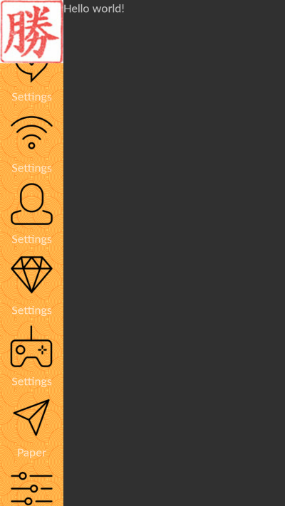
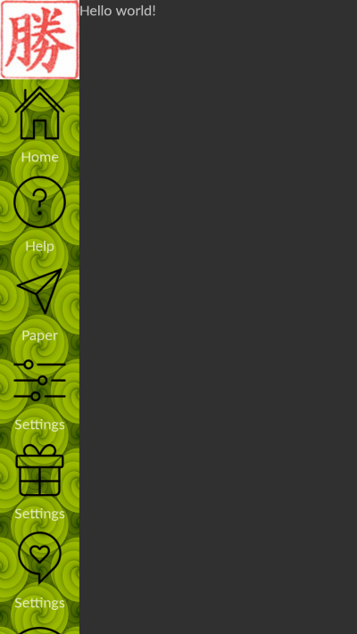

# LongMenu
Easy Setup the dynamic long menu in JAVA Android

why
==========
Look into some simple designed yet in slow performance webapp and it needs to be enhanced and rendered in native mode. 


setup
==========
Nothing need to think about and just call in a single line.

```xml
 <fragment
        android:id="@+id/menu"
        android:layout_width="wrap_content"
        android:layout_height="match_parent"
        android:name="com.hkm.longmenu.LongMenuComponent" />

```
Get the componenet in the code
```java
   LongMenuComponent fragment_byID = (LongMenuComponent) getFragmentManager().findFragmentById(R.id.menu);

        Bind b = new Bind(80, this);
        b.setItemHeight(90);
  
        b.setIconPadding(0f);
        b.setWithSeparator(false);
        b.setResIdCompanyLogo(R.drawable.icoshlogo);
        b.setAddListMenu(new menuitem(R.drawable.home128, "Home"));
        b.setAddListMenu(new menuitem(R.drawable.diamond28, "Settings", MenuDishes.class));

        fragment_byID.init(b);
        
 ```


Support fragment transition. v4 is not yet supported.

```java
   LongMenuComponent fragment_byID = (LongMenuComponent) getFragmentManager().findFragmentById(R.id.menu);

        Bind b = new Bind(80, this);
        b.setItemHeight(90);

        b.setIconPadding(0f);
        b.setWithSeparator(false);
        b.setResIdCompanyLogo(R.drawable.icoshlogo);
        b.setAddListMenu(new menuitem(R.drawable.home128, "Home"));
        b.setAddListMenu(new menuitem(R.drawable.diamond28, "Settings", MenuDishes.class));

        fragment_byID.setFragmentManager(frame_id, fragment_manager);
        fragment_byID.init(b);

 ```

Gradle
===================
```gradle
compile  'com.hkm.ui:uieasylongmenu:0.2.11'
```
Overview
===================



### Thank you for your support and we will bring more amazing libraries to your productive works. We are accepting bitcoin by the address as below. Please scan the QR code to start

